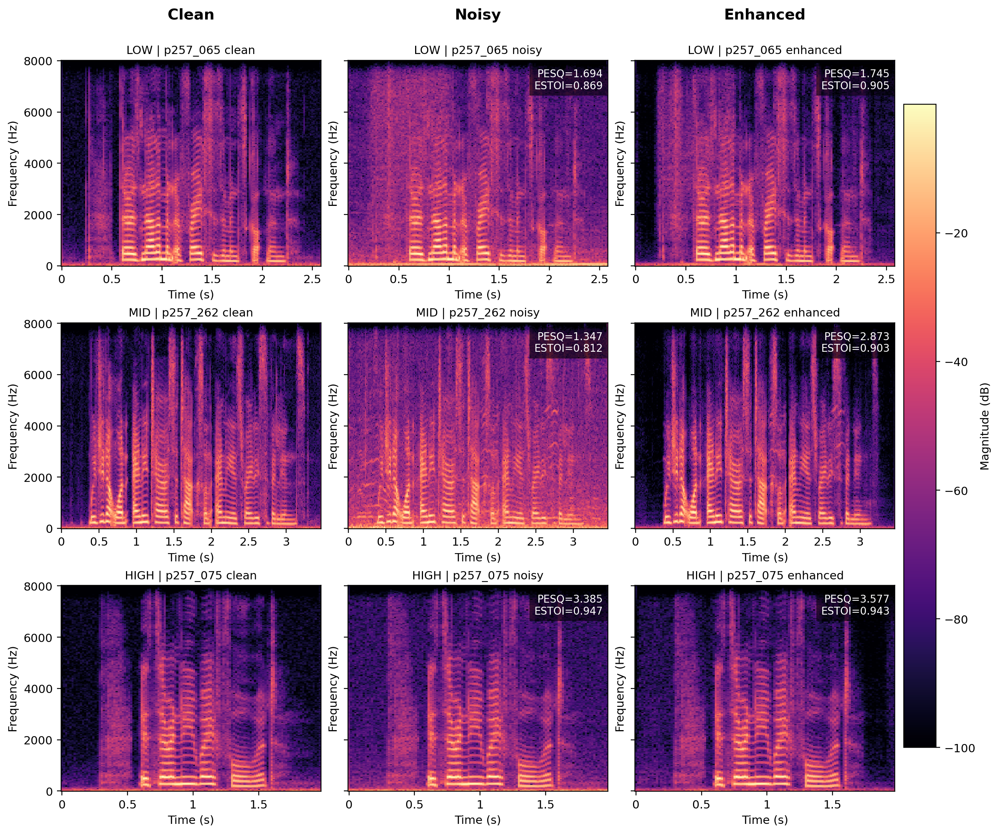

# LNN_SE

LNN_SE 是一个基于 DCCRN 风格编码器-解码器结构和 Liquid Neural Network 思想的轻量级单通道语音增强项目。

本项目实现了一个简易的端到端的语音增强模型。模型输入为带噪语音波形，输出为增强后的语音波形。该模型主要结合了ERB 频带压缩、CNN 编码器-解码器、轻量级Liquid/CfC时序建模模块，以及复数掩码估计方法。

本仓库已经提供预训练模型权重：

```text
pretrained/best_model_120.tar
```

---

## 1. 模型基本介绍

本项目的主要目标是探索将 Liquid Neural Network 风格的轻量级时序建模模块应用于语音增强任务的可行性。

传统语音增强模型中，时序建模部分常采用 LSTM、GRU、TCN 或 Transformer 等结构。本项目在整体结构上保留了较为清晰的 DCCRN 风格编码器-解码器框架，同时将其中的时序建模模块替换为轻量级 Liquid/CfC 风格模块，用于验证该类模型在语音增强任务中的表现。

模型整体流程如下：

```text
带噪语音波形
    ↓
STFT
    ↓
ERB 频带压缩
    ↓
CNN 编码器
    ↓
Liquid/CfC 风格时序建模模块
    ↓
CNN 解码器
    ↓
复数掩码估计
    ↓
iSTFT
    ↓
增强语音波形
```

本项目的主要特点包括：

- 端到端语音增强，从 waveform 到 waveform
- 使用轻量级 Liquid/CfC 风格模块进行时序建模
- 支持模型推理、侵入式客观指标评估、RTF 实时性统计和语谱图可视化
- 提供预训练模型权重，便于快速测试

本项目主要用于学习、复现和验证Liquid Neural Network风格时序模块在语音增强任务中的应用效果。

---

## 2. 模型性能表现

本项目支持使用侵入式语音增强指标对模型进行评估，包括：

- SNR
- SI-SNR
- PESQ
- ESTOI

在完成推理后，增强语音和对应的 `scp` 文件会被保存到 `configs/cfg_infer.yaml` 中 `network.enh_folder` 指定的输出目录下。

随后运行评估脚本，评估结果会保存到：

```text
scoring_intrusive/
```

如果启用带噪语音 baseline 评估，结果会额外保存到：

```text
scoring_intrusive_noisy/
```

本项目还支持在推理阶段统计实时因子 RTF。若推理时加入 `--save-rtf` 参数，程序会保存每条语音的 RTF 结果以及平均 RTF 统计结果。

测试结果如下

| 指标 | SNR | SI-SNR | PESQ | ESTOI | meanRTF |
| --- | ---: | ---: | ---: | ---: | ---: |
| 带噪语音 | 8.4471 | 8.4462 | 1.9720 | 0.7867 | - |
| LNN_SE 增强语音 | 18.2831 | 18.2829 | 2.7624 | 0.8452 | 0.014049 |

按PESQ得分从低到高取了三个样本的频谱图进行展示：


---

## 3. 快速开始

### 3.1 环境要求

本项目基于 Python 和 PyTorch 实现。可使用如下命令快速安装依赖

```bash
pip install -r requirements.txt 
```

### 3.2 数据集准备

本项目模型在经典数据集 **VoiceBank + DEMAND** 上进行训练与验证

推荐的数据集目录结构如下：

```text
Datasets/
├── clean_trainset_wav/
├── noisy_trainset_wav/
├── clean_validation_wav/
├── noisy_validation_wav/
├── clean_testset_wav/
└── noisy_testset_wav/
```

### 3.3 运行推理

使用预训练模型对带噪测试语音进行增强：

```bash
python infer.py
```

增强后的语音会保存到配置文件中的：

```text
network.enh_folder
```

输出的增强语音文件默认带有如下后缀：

```text
_enh.wav
```

## 4. 参考代码

代码借鉴了优秀的语音增强训练模板[SEtrain](https://github.com/Xiaobin-Rong/SEtrain)，思路受[LNN-Speech-Enhancement](https://github.com/chengzihanxxx/LNN-Speech-Enhancement)启发。

---

## 说明

本仓库主要用于轻量级实验验证，重点关注Liquid Neural Network风格时序建模模块在语音增强任务中的可行性，使用的Liquid/CfC风格模块是面向语音增强实验的简化时序建模模块，并不等同于严格意义上的连续时间 LTC 实现。代码为本人出于业余兴趣爱好编写，如有错误，请多多见谅。
